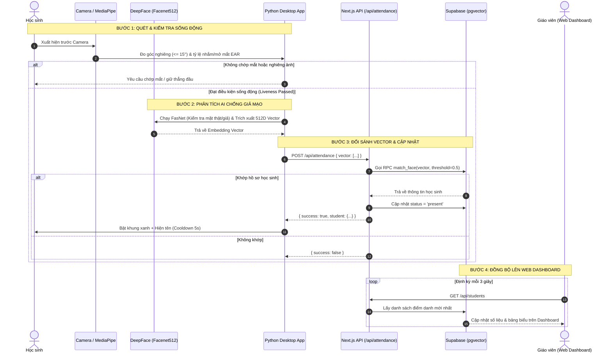

# 🎓 AI-Based Attendance System (Hệ Thống Điểm Danh Thông Minh Bằng AI)

Hệ thống điểm danh học sinh thông minh kết hợp giữa ứng dụng máy trạm AI nhận diện khuôn mặt thời gian thực (Desktop Client) và bảng điều khiển quản trị tập trung (Web Dashboard). Hệ thống tích hợp công nghệ chống giả mạo đa tầng (Liveness Detection & Anti-Spoofing) cùng cơ sở dữ liệu vector tốc độ cao.

---

## 🌟 Tính Năng Nổi Bật

1. **Nhận diện khuôn mặt thời gian thực**: Trích xuất vector đặc trưng 512 chiều sử dụng mô hình **FaceNet512** (DeepFace).
2. **Chống giả mạo đa tầng (Multi-layer Anti-Spoofing)**:
   - **Phát hiện cử chỉ sống động (MediaPipe FaceLandmarker)**: Bắt buộc chớp mắt thật qua chỉ số **EAR (Eye Aspect Ratio)** và kiểm tra góc nghiêng đầu ($\le 15^\circ$) để chống dùng ảnh/video lắc lư trước camera.
   - **Mạng nơ-ron chống giả mạo (FasNet)**: Phân tích kết cấu bề mặt da để phát hiện và chặn màn hình điện thoại, ảnh in giấy.
3. **Đối sánh Vector siêu tốc (pgvector)**: Sử dụng PostgreSQL RPC Cosine Distance trên **Supabase** để tìm kiếm học sinh chính xác trong hàng ngàn hồ sơ với ngưỡng tương đồng $\ge 0.5$.
4. **Dashboard Quản trị Hiện đại**: Xây dựng trên nền **Next.js App Router**, tự động cập nhật trạng thái có mặt/vắng mặt theo thời gian thực (Polling 3s), trực quan hóa biểu đồ xu hướng tuần và hỗ trợ thao tác nhanh (Tìm kiếm, Reset All, Xóa học sinh).

---

## 🛠️ Công Nghệ Sử Dụng (Tech Stack)

| Thành phần | Công nghệ / Thư viện |
| :--- | :--- |
| **Desktop AI Client** | Python 3.10+, OpenCV, MediaPipe, DeepFace (FaceNet512 + FasNet), Tkinter, Pillow, Requests |
| **Web Dashboard** | Next.js 16 (App Router), TypeScript, Tailwind CSS, Recharts, Lucide Icons, Axios |
| **Database & Backend** | Supabase (PostgreSQL 17, `pgvector` extension, PostgREST) |

---

## 📁 Cấu Trúc Thư Mục Tái Cấu Trúc (Architecture)

Dự án đã được module hóa triệt để theo kiến trúc phân tầng, phân tách rành mạch giữa giao diện, logic xử lý và tầng dữ liệu:

```plaintext
AI-BasedAttendanceSystem/
│
├── client_core/                       # [Python Client] Các module lõi của ứng dụng máy trạm
│   ├── config.py                      # Hằng số, API URLs, Supabase Keys, tải model tự động
│   ├── camera.py                      # Quản lý phần cứng webcam, quét và mở cổng camera
│   ├── liveness.py                    # Thuật toán MediaPipe: tính chỉ số EAR (chớp mắt) & góc nghiêng
│   ├── recognizer.py                  # Module AI: DeepFace Facenet512 & FasNet Anti-spoofing
│   ├── api_service.py                 # Tầng mạng: Gửi vector điểm danh và ghi danh sang Supabase
│   └── ui/                            # Tầng giao diện Tkinter
│       ├── main_window.py             # Cửa sổ chính, luồng lặp đọc frame 30ms, vẽ Bounding Box
│       └── enrollment_dialog.py       # Popup form đăng ký học sinh mới
│
├── frontend/                          # [Web Dashboard] Ứng dụng Next.js quản trị
│   ├── app/                           # Next.js App Router
│   │   ├── api/                       # API Routes trung gian (attendance, students, reset, delete)
│   │   ├── page.tsx                   # Trang Dashboard chính (tinh gọn, chỉ điều phối components)
│   │   └── layout.tsx                 # Root layout & Metadata
│   ├── components/dashboard/          # Các Component giao diện độc lập
│   │   ├── Sidebar.tsx                # Thanh điều hướng và thông tin admin
│   │   ├── MetricCard.tsx             # Thẻ thống kê chỉ số (Total, Present, Absent)
│   │   ├── AttendanceChart.tsx        # Biểu đồ Recharts xu hướng điểm danh trong tuần
│   │   ├── AttendanceTable.tsx        # Bảng danh sách học sinh, tìm kiếm và nút thao tác
│   │   └── SetupView.tsx              # Hướng dẫn cấu hình kết nối Local AI
│   ├── hooks/                         # Custom Hooks
│   │   └── useAttendance.ts           # Quản lý toàn bộ State, Polling 3s và các hàm gọi API
│   ├── types/                         # Định nghĩa kiểu dữ liệu TypeScript (Student)
│   └── config/                        # Cấu hình dữ liệu tĩnh (Trend data, Menu items)
│
├── local_face_recognition.py          # Entry Point chính khởi chạy Python Desktop Client
├── sqlscript.md                       # Kịch bản SQL khởi tạo bảng students & hàm RPC match_face
└── requirements.txt                   # Danh sách thư viện Python cần thiết
```

---

## 🔄 Luồng Dữ Liệu Hoạt Động (Data Flow)



---

## 🚀 Hướng Dẫn Cài Đặt & Khởi Chạy

### 1. Chuẩn bị Cơ sở dữ liệu Supabase
1. Đăng nhập vào [Supabase Dashboard](https://supabase.com).
2. Vào **SQL Editor**, copy toàn bộ nội dung trong file [sqlscript.md](sqlscript.md) và chạy (Run) để tạo extension `vector`, bảng `students` và hàm đối sánh `match_face`.

### 2. Khởi chạy Web Dashboard
Yêu cầu: Node.js 18+ đã được cài đặt.
```bash
# Di chuyển vào thư mục frontend
cd frontend

# Cài đặt các gói phụ thuộc
npm install

# Khởi chạy máy chủ phát triển
npm run dev
```
Dashboard sẽ chạy tại địa chỉ: `http://localhost:3000`.

### 3. Khởi chạy Desktop AI Client
Yêu cầu: Python 3.10+ đã được cài đặt.
```bash
# Tại thư mục gốc dự án, cài đặt các thư viện AI
pip install -r requirements.txt

# Khởi chạy ứng dụng máy trạm
python local_face_recognition.py
```
- Trên giao diện Tkinter, chọn Camera trong danh sách và bấm **Start Camera**.
- Bấm **Enroll New Student** để đăng ký học sinh mới.
- Học sinh đứng trước camera, giữ thẳng đầu và chớp mắt để hoàn tất điểm danh.
